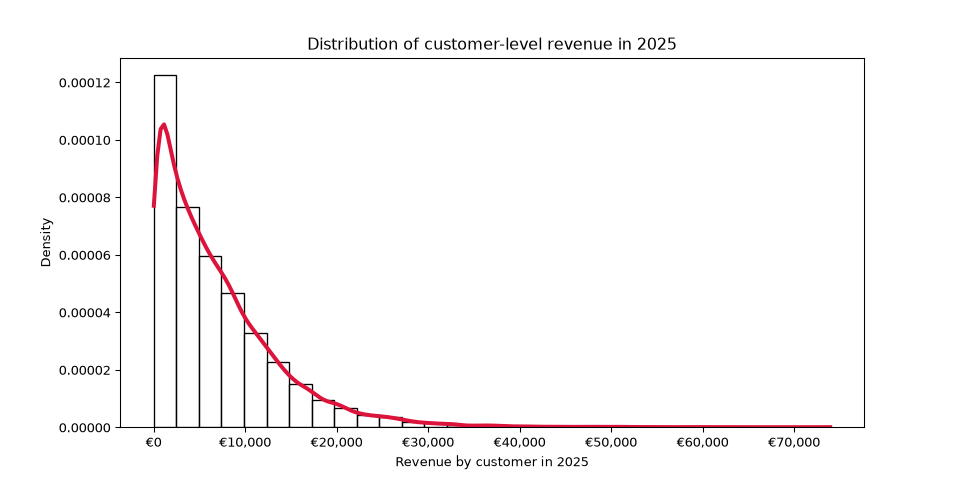
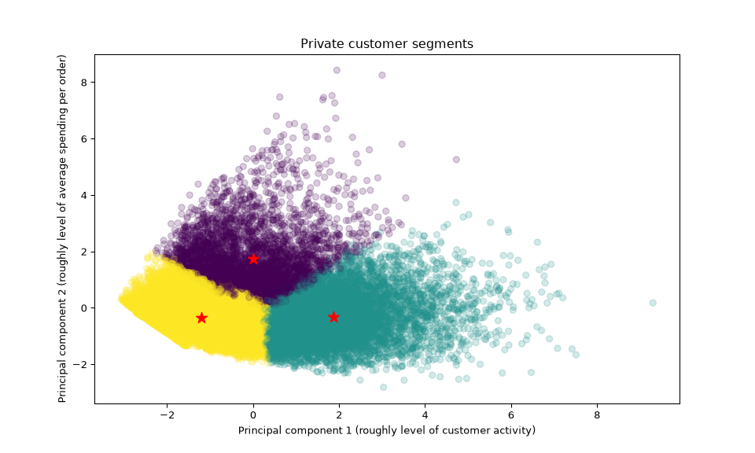
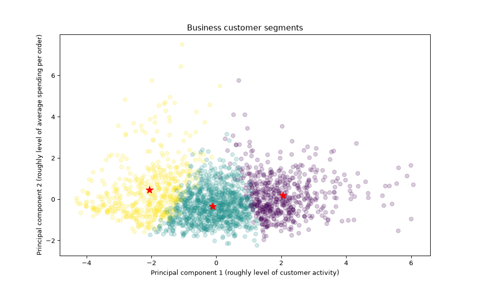

Music Retailer Sales SQL Project
================
Dominik Schulz,
October 10, 2026

- [1 Executive summary](#1-executive-summary)
- [2 Company & data information](#2-company--data-information)
- [3 Objectives](#3-objectives)
- [4 Applied tools](#4-applied-tools)
- [5 Detailed project results](#5-detailed-project-results)
  - [5.1 Revenue & sales performance](#51-revenue--sales-performance)
  - [5.2 Customer health](#52-customer-health)
  - [5.3 Product portfolio](#53-product-portfolio)
  - [5.4 Pricing](#54-pricing)
  - [5.5 Inventory health](#55-inventory-health)
  - [5.6 Supplier health](#56-supplier-health)

<!-- README.md is generated from README.Rmd. Please edit that file -->

**Note:** This entire project is currently a work in progress and not
yet finished. It will be updated regularly.

# 1 Executive summary

1.  Revenue has grown, but customers are placing fewer orders per active
    customer over time. The 2024–2025 decomposition below identifies
    higher order volume as the largest arithmetic contributor to the
    increase in gross order value. Customer acquisition remains
    important, but acquisition should be complemented by retention and
    reactivation efforts. Targeted offers or a loyalty scheme could be
    tested with a holdout group, with success measured by incremental
    repeat orders and contribution margin rather than discount
    redemptions alone.

# 2 Company & data information

The company is an online retailer of musical equipment and related
items. The dataset covers the company’s sales from 2022 through 2025,
along with information on registered customers, sale items, products,
inventory movements, and related entities.

**Note:** The data used is the synthetic SQL database
`musical_retail_germany.sql` provided in my GitHub repository
[dschulz13/musical_retail_germany](https://github.com/dschulz13/musical_retail_germany).

The available data is structured as displayed in Figure
<a href="#fig:fig-struct">2.1</a>.

Figure 2.1: An overview of the
structure of the musical_retail_germany SQL database.

The database contains eight interconnected tables: `sales`,
`sale_items`, `products`, `product_prices`, `customers`, `suppliers`,
`inventory_in`, and `inventory_out`.

# 3 Objectives

The data supports six broad business topics, each with several
sub-questions. They help determining the current state of the company at
the end of the year 2025. This project aims to address the presented
questions as the analysis is developed.

1.  **Revenue & sales performance**

- How much was sold in 2025?
- How did 2025 compare with 2024?
- Is revenue growing?
- How many customers are registered, and how many orders are placed?
- What is the average order value?
- What accounts for the increase or decrease in revenue?

2.  **Customer health**

- How many active customers are there in 2025?
  - How many of them are new and how many are returning?
- How concentrated is revenue among customers?
- What does customer purchasing frequency look like?
- Are there high-value customer segments?
- Are customers becoming more or less valuable?

3.  **Product portfolio**

- Which categories/brands/products drive revenue?
- Which products are growing?
- Which products have poor sales?
- How concentrated is revenue among products?
- Which products are newly introduced?
- Which products have been discontinued?

4.  **Pricing**

- Which products experienced major price changes?
- What happened to sales volumes after price changes?
- Which products increased in price without losing much volume?
- Which products became cheaper but sold considerably more?
- Which brands/categories have the highest prices?

5.  **Inventory health**

- Which products are overstocked?
- Which products have very high inventory turnover?
- Which products appear to be slow-moving?
- How much capital is tied up in inventory?
- Are discontinued products still sitting in inventory?
- Which products might need replenishment?

6.  **Supplier health**

- Which suppliers provide the most products?
- Which suppliers account for the most incoming units?
- Is the company highly dependent on a small number of suppliers?
- Which suppliers serve strategically important products?
- What does the supplier base look like geographically?

# 4 Applied tools

Data manipulation, calculations and table creations are performed in
[MySQL](https://www.mysql.com/de/). Graphics and unsupervised learning
techniques, used only sparingly where clearly helpful in this MySQL
project, are created with [Python](https://www.python.org/), while [R
Markdown](https://rmarkdown.rstudio.com/) is used to generate the report
and format the final table outputs.

# 5 Detailed project results

This section presents the results available so far, with tables,
figures, and corresponding recommendations. Results are organized by
topic and business question.

## 5.1 Revenue & sales performance

### 5.1.1 How much was sold in 2025?

**SQL approach for total 2025 figure**

1.  Filter `sales` to transactions recorded in 2025.
2.  Sum `total_price_eur - shipping_fee_eur` to calculate sales after
    subtracting shipping fees.

**SQL approach for absolute figures in Table
<a href="#tab:sales-monthly-tab">5.1</a>**

1.  Filter sales to 2025 and extract the month from each sale timestamp.
2.  Group by month and sum sales after subtracting shipping fees.
3.  Pivot the 12 monthly totals into one row with conditional
    aggregation (`MAX(CASE WHEN ...)`).

**SQL approach for relative figures in Table
<a href="#tab:sales-monthly-tab">5.1</a>**

1.  Filter sales to 2025, extract the month, and calculate each month’s
    total after subtracting shipping fees.
2.  Use the sum of all monthly totals as the annual denominator.
3.  Calculate each month’s share of annual sales and format it as a
    percentage.
4.  Pivot the monthly percentages into one row for presentation.

**Results**

The **net sales total** for 2025, defined here as `total_price_eur`
minus shipping fees, is **€181,162,213.59**.

Table <a href="#tab:sales-monthly-tab">5.1</a> shows monthly net sales
for 2025. October, November, and December recorded **€15,862,459.29**,
**€20,654,304.18**, and **€19,996,241.47**, respectively. Together,
these three months contributed approximately **31.2%** of annual net
sales, indicating a pronounced fourth-quarter peak.

|  | January | February | March | April | May | June | July | August | September | October | November | December |
|----|---:|---:|---:|---:|---:|---:|---:|---:|---:|---:|---:|---:|
| Absolute | €11,634,671.43 | €13,224,547.24 | €14,406,142.15 | €14,108,479.68 | €14,687,588.63 | €13,669,492.17 | €13,437,017.96 | €14,455,434.75 | €15,025,834.64 | €15,862,459.29 | €20,654,304.18 | €19,996,241.47 |
| Relative | 6.42% | 7.30% | 7.95% | 7.79% | 8.11% | 7.55% | 7.42% | 7.98% | 8.29% | 8.76% | 11.40% | 11.04% |

Table 5.1: Monthly total sales
(absolute and relative) of the year 2025.

### 5.1.2 How did 2025 compare with 2024?

**SQL approach for total 2024 figure**

1.  Filter `sales` to transactions recorded in 2024.
2.  Sum `total_price_eur - shipping_fee_eur` to calculate the comparable
    net-of-shipping sales total for 2024.

**SQL approach for Table <a href="#tab:sales-monthly-comp">5.2</a>**

1.  Filter transactions to 2024 and 2025, then aggregate net-of-shipping
    sales by year and month.
2.  Use `LAG()` partitioned by month to align each 2025 month with the
    corresponding 2024 value.
3.  Keep the 2025 rows and calculate absolute and relative
    year-over-year changes.
4.  Format the monetary values and percentage changes for the comparison
    table.

**Results**

Net sales totaled **€181,162,213.59** in 2025, an **increase** of
**€20,310,547.77** (**12.63%**) compared with 2024, when net sales were
**€160,851,665.82**.

| Month     |     Sales 2024 |     Sales 2025 | Absolute change | Relative change |
|:----------|---------------:|---------------:|----------------:|----------------:|
| January   | €10,662,098.53 | €11,634,671.43 |     €972,572.90 |           9.12% |
| February  | €12,509,612.61 | €13,224,547.24 |     €714,934.63 |           5.72% |
| March     | €12,716,601.72 | €14,406,142.15 |   €1,689,540.43 |          13.29% |
| April     | €12,951,284.01 | €14,108,479.68 |   €1,157,195.67 |           8.93% |
| May       | €13,269,831.06 | €14,687,588.63 |   €1,417,757.57 |          10.68% |
| June      | €12,281,043.47 | €13,669,492.17 |   €1,388,448.70 |          11.31% |
| July      | €11,909,782.25 | €13,437,017.96 |   €1,527,235.71 |          12.82% |
| August    | €12,686,576.47 | €14,455,434.75 |   €1,768,858.28 |          13.94% |
| September | €13,107,929.40 | €15,025,834.64 |   €1,917,905.24 |          14.63% |
| October   | €13,674,035.81 | €15,862,459.29 |   €2,188,423.48 |          16.00% |
| November  | €17,877,541.31 | €20,654,304.18 |   €2,776,762.87 |          15.53% |
| December  | €17,205,329.18 | €19,996,241.47 |   €2,790,912.29 |          16.22% |

Table 5.2: Monthly sales
comparison between the years 2024 and 2025.

As Table <a href="#tab:sales-monthly-comp">5.2</a> shows, net sales
increased in every month of 2025 compared with the same month in 2024.
February had the smallest relative increase (5.72%), followed by April
(8.93%) and January (9.12%). The largest relative increases occurred in
October, November, and December.

### 5.1.3 Is revenue growing?

**SQL approach for Table <a href="#tab:revenue-monthly-comp">5.3</a>**

1.  Aggregate `total_price_eur` by year and month; this query does not
    subtract shipping fees.
2.  Use windowed `LAG()` values to retrieve the same month’s revenue
    from the previous three years.
3.  For the 2025 row, calculate relative changes for 2022–2023,
    2023–2024, and 2024–2025.
4.  Return the monthly comparison in calendar order.

**Results**

| Month     | Change 2022 to 2023 | Change 2023 to 2024 | Change 2024 to 2025 |
|:----------|--------------------:|--------------------:|--------------------:|
| January   |               5.40% |               9.52% |               9.11% |
| February  |               9.71% |              10.35% |               5.72% |
| March     |              11.48% |               5.01% |              13.27% |
| April     |               6.70% |               7.06% |               8.93% |
| May       |               6.31% |               8.90% |              10.67% |
| June      |               6.63% |               9.29% |              11.30% |
| July      |               6.42% |              10.13% |              12.81% |
| August    |               7.20% |              11.48% |              13.94% |
| September |               7.87% |               7.08% |              14.62% |
| October   |               8.60% |              10.25% |              15.99% |
| November  |               9.28% |               9.11% |              15.52% |
| December  |               6.53% |               9.42% |              16.21% |

Table 5.3: Yearly relative
revenue changes by month 2022 through 2025.

Table <a href="#tab:revenue-monthly-comp">5.3</a> shows positive
year-over-year growth for every month in each comparison presented. The
growth rate accelerated from 2024 to 2025 in March through December, but
slowed in January and February. This is a change in the **growth rate**,
not a decline in revenue in those two months.

The largest acceleration was in March, when the growth rate rose from
5.01% to 13.27%—an increase of 8.26 percentage points. From September
through December, the growth rate increased by roughly five to seven
percentage points. Because this query sums `total_price_eur` without
subtracting shipping fees, these figures are not on the same
net-of-shipping basis as the sales totals in Sections 6.1.1–6.1.2.

### 5.1.4 How many registered and active customers are there?

**SQL approach for Table <a href="#tab:reg-cust-tab">5.4</a>**

1.  Assign each customer to a registration-year bucket: 2022 or earlier,
    2023, 2024, or 2025.
2.  Count registrations within each bucket.
3.  Calculate a cumulative sum across the buckets to obtain the
    registered-customer total at each year-end.
4.  Pivot the cumulative totals into one row, with one column per year.

**SQL approach for Table <a href="#tab:act-cust-tab">5.5</a>**

1.  Extract the sale year and customer ID from each sale.
2.  Count distinct customers with at least one sale in each year.
3.  Pivot those yearly counts into one row for 2022–2025.

**Results**

|   2022 |   2023 |   2024 |   2025 |
|-------:|-------:|-------:|-------:|
| 16,000 | 20,500 | 25,000 | 30,000 |

Table 5.4: Cumulative number of
registered customers by year.

Table <a href="#tab:reg-cust-tab">5.4</a> shows that the
registered-customer base nearly doubled from 2022 to 2025. By the end of
2025, the platform had **30,000 registered customers**.

|   2022 |   2023 |   2024 |   2025 |
|-------:|-------:|-------:|-------:|
| 14,463 | 18,157 | 21,908 | 26,408 |

Table 5.5: Number of active customers
by year.

Table <a href="#tab:act-cust-tab">5.5</a> shows the number of **active
customers**, defined as customers who placed at least one order in the
corresponding year. Active customers are fewer than registered customers
in every year. The active-customer share of the registered base ranged
from **87.63%** to **90.39%**, and was **88.03%** in 2025.

### 5.1.5 What is the average order value?

**SQL approach for Table <a href="#tab:tab-average-order">5.6</a>**

1.  Group sales by calendar year and calculate the average
    `total_price_eur` per order.
2.  Pivot the four annual averages into one row and format them as euro
    amounts.

**Results**

|      2022 |      2023 |      2024 |      2025 |
|----------:|----------:|----------:|----------:|
| €2,179.57 | €2,175.15 | €2,192.33 | €2,268.35 |

Table 5.6: Yearly average order
value for years 2022 through 2025.

According to Table <a href="#tab:tab-average-order">5.6</a>, average
order value fell slightly from 2022 to 2023 and then increased in both
2024 and 2025. The 2025 average was **€2,268.35**. This calculation uses
`total_price_eur`; unlike the net sales totals earlier in this section,
it does not subtract shipping fees.

### 5.1.6 What accounts for the increase or decrease in revenue?

**SQL approach for Table <a href="#tab:tab-num-order">5.7</a>**

1.  Count the number of sales records (orders) in each year.
2.  Separately count distinct active customers per year and join those
    counts to the annual order counts.
3.  Divide orders by active customers to calculate average orders per
    active customer.
4.  Combine the order-count and order-frequency rows, then pivot the
    annual values into columns.

**SQL approach for Table <a href="#tab:tab62">5.8</a>**

1.  Select 2025 sales and join them to customer records, grouping
    customers by whether they registered before 2025 or during 2025.
2.  For each registration group, calculate order count, total
    `total_price_eur`, and average order value.
3.  Separately count distinct active customers in each registration
    group.
4.  Join the summaries and calculate orders per active customer; format
    the monetary and count fields for the table.

**Results**

|                   |   2022 |   2023 |   2024 |   2025 |
|-------------------|-------:|-------:|-------:|-------:|
| Number of orders  | 63,000 | 68,000 | 73,500 | 80,000 |
| Orders per capita |   4.36 |   3.75 |   3.35 |   3.03 |

Table 5.7: Yearly order counts and
average orders per active customer.

| Signup year | Order count | Orders per capita | Revenue | Average order value |
|:---|---:|---:|---:|---:|
| before 2025 | 72,301 | 3.23 | €164,052,186.74 | €2,269.02 |
| in 2025 | 7,699 | 1.92 | €17,415,849.65 | €2,262.09 |

Table 5.8: Distinction between existing and
new customers in 2025.

Table <a href="#tab:tab-num-order">5.7</a> shows that the **number of
orders** increased each year, while the **average number of orders per
active customer** declined from 4.36 in 2022 to 3.03 in 2025.
Multiplying order frequency by average order value gives an approximate
annual order value per active customer of **€6,873.10** in 2025, down
from **€7,344.31** in 2024. The active-customer share of the registered
base was broadly stable. These figures suggest that growth is associated
with a larger customer base and more orders overall, but they do not by
themselves establish how much of the increase was caused by new
registrations.

Using the rounded order counts and average order values, the estimated
increase in **gross order value** from 2024 to 2025 is
**€20,331,745.00**. If average order value had remained at its 2024
level, the increase in order count would account for **€14,250,145.00**
of the increase. If order count had remained at its 2024 level, the
higher average order value would account for **€5,587,470.00**. The
remaining **€494,130.00** is the interaction between the two changes. On
this decomposition, higher order volume is the largest arithmetic
contributor. Note that this calculation uses `total_price_eur` and
rounded averages, whereas the headline sales totals subtract shipping
fees; the resulting amounts are therefore not directly comparable and
may not reconcile exactly.

Table <a href="#tab:tab62">5.8</a> shows that customers registered
before 2025 generated **€164,052,186.74** in gross order value during
2025, compared with **€17,415,849.65** from customers who registered
during 2025. These figures are useful for describing the 2025 cohorts,
but they should not be directly compared with the 2024 net sales total
because the definitions differ. The newer registration cohort recorded
fewer orders per active customer, which may partly reflect its shorter
time on the platform.

Customer acquisition is valuable, but sustained growth also depends on
retention. The company should test ways to **reactivate lapsed
customers** and increase repeat purchases among active customers.
Options include targeted discounts for lapsed or long-standing customers
and a loyalty programme that rewards repeat orders. A controlled pilot
with a holdout group would help determine whether these interventions
create incremental orders and margin, rather than simply discounting
purchases that would have happened anyway.

## 5.2 Customer health

### 5.2.1 How many active customers are there in 2025?

**Sub-question:** How many of them are new and how many are returning?

**SQL approach for Table <a href="#tab:tab7">5.9</a>**

1.  Number each customer’s purchases chronologically across the full
    sales history.
2.  Keep the customer’s 2025 purchases and classify the customer as new
    if their first-ever purchase is in 2025, otherwise as returning.
3.  Count customers in each group and calculate each group’s percentage
    of all active customers in 2025.
4.  Return absolute counts and relative shares as two rows.

**Results**

|          | Returning |    New |   Total |
|----------|----------:|-------:|--------:|
| Absolute |    20,789 |  5,619 |  26,408 |
| Relative |    78.72% | 21.28% | 100.00% |

Table 5.9: New and returning customers in
2025.

Table <a href="#tab:tab7">5.9</a> shows **26,408 active customers** in
2025, defined as customers who placed at least one order during the
year. A **new customer** is one whose first-ever purchase occurred in
2025, regardless of registration date. On this basis, **5,619 customers
(21.28%)** were new buyers and **20,789 (78.72%)** were returning
buyers.

### 5.2.2 How concentrated is revenue among customers?

**SQL approach for Table <a href="#tab:tab8">5.10</a>**

1.  Construct revenue intervals in €5,000 steps, with an upper limit of
    €75,000.
2.  Sum each customer’s `total_price_eur` across 2025 sales.
3.  Assign each customer to the interval containing their 2025 revenue
    and count customers by interval.
4.  Calculate each interval’s share of the customers included in the
    grouped results and order the intervals from low to high.

**Results:**

| Revenue interval    | Customer count | Relative |
|:--------------------|---------------:|---------:|
| \[€0, €5,000)       |         13,044 |   49.39% |
| \[€5,000, €10,000)  |          6,952 |   26.33% |
| \[€10,000, €15,000) |          3,584 |   13.57% |
| \[€15,000, €20,000) |          1,555 |    5.89% |
| \[€20,000, €25,000) |            687 |    2.60% |
| \[€25,000, €30,000) |            331 |    1.25% |
| \[€30,000, €35,000) |            129 |    0.49% |
| \[€35,000, €40,000) |             64 |    0.24% |
| \[€40,000, €45,000) |             25 |    0.09% |
| \[€45,000, €50,000) |             16 |    0.06% |
| \[€50,000, €55,000) |             11 |    0.04% |
| \[€55,000, €60,000) |              4 |    0.02% |
| \[€60,000, €65,000) |              2 |    0.01% |
| \[€65,000, €70,000) |              3 |    0.01% |
| \[€70,000, €75,000) |              1 |    0.00% |

Table 5.10: Active customers in 2025 by 2025
revenue.

Table <a href="#tab:tab8">5.10</a> shows 2025 revenue per active
customer grouped into revenue intervals. These amounts use
`total_price_eur`, so they are not directly comparable with the
net-of-shipping sales totals reported earlier. The distribution is
strongly right-skewed: **49.39%** of active customers generated less
than **€5,000**, and approximately **75.72%** generated less than
**€10,000**. Only **0.08%** generated at least **€50,000**. The query’s
displayed intervals stop below €75,000, so confirm that the data contain
no customers at or above that threshold before treating the table as
exhaustive.

Figure 5.1: Histogram and kernel
density of customer-level revenue in 2025.

Figure <a href="#fig:fig-dist-rev">5.1</a>, created in Python, combines
a histogram of customer-level revenue in 2025 with a kernel density
estimate. The plot makes the distribution’s strong right skew and long
upper tail easier to see.

### 5.2.3 What does customer purchasing frequency look like?

**SQL approach for Table <a href="#tab:tab9">5.11</a>**

1.  Use `LAG()` to find each customer’s previous sale timestamp and
    calculate the elapsed time in days.
2.  Keep order intervals associated with sales made in 2025.
3.  Build 100-day intervals from 0 through 1,399 days and assign each
    eligible order interval to a bin.
4.  Count intervals in each bin and calculate their percentage of all
    intervals included in the bins.

**Results**

| Days since last purchase | Order count | Relative |
|:-------------------------|------------:|---------:|
| between 0 and 99         |      45,988 |   61.83% |
| between 100 and 199      |      15,884 |   21.35% |
| between 200 and 299      |       6,714 |    9.03% |
| between 300 and 399      |       3,092 |    4.16% |
| between 400 and 499      |       1,403 |    1.89% |
| between 500 and 599      |         681 |    0.92% |
| between 600 and 699      |         307 |    0.41% |
| between 700 and 799      |         155 |    0.21% |
| between 800 and 899      |          72 |    0.10% |
| between 900 and 999      |          48 |    0.06% |
| between 1000 and 1099    |          25 |    0.03% |
| between 1100 and 1199    |           9 |    0.01% |
| between 1200 and 1299    |           1 |    0.00% |
| between 1300 and 1399    |           2 |    0.00% |

Table 5.11: Order counts in 2025 by days
since last purchase.

Among the order intervals assigned to the reported bins, **61.83%** fell
within 99 days of the previous purchase and **83.18%** within 199 days.
**3.63%** fell into bins of 400 days or more; this should not be
described as the share taking more than a year, because the 300–399-day
bin straddles the one-year mark. The table counts order intervals, not
unique customers: the 37 observations at 1,000 days or more should
therefore be described as **orders**, not customers. Overall,
repeat-purchase intervals are strongly right-skewed.

### 5.2.4 Are there high-value customer segments?

**SQL approach for Table <a href="#tab:tab10">5.12</a>**

1.  Aggregate 2025 revenue and order count separately for each customer.
2.  Calculate recency and time since first purchase relative to January
    01, 2026 (taken as the current time point).
3.  Join sales to sale items and product data to count distinct
    categories purchased by each customer in 2025.
4.  Join those features to the cleaned customer type, calculate revenue
    shares and average revenue per order, then return the 20
    highest-revenue customers.

**Results**

| Customer ID | Total revenue | Relative revenue | Order count | Average revenue per order | Customer type | Days since last purchase | Days since first purchase | Product categories |
|---:|---:|---:|---:|---:|---:|---:|---:|---:|
| 13597 | €73,936.02 | 0.04% | 19 | €3,891.37 | business | 34.43 | 1,283.34 | 9 |
| 7188 | €68,869.68 | 0.04% | 22 | €3,130.44 | business | 2.54 | 1,427.33 | 8 |
| 10773 | €68,352.92 | 0.04% | 17 | €4,020.76 | business | 16.43 | 1,442.57 | 9 |
| 21762 | €68,133.97 | 0.04% | 22 | €3,097.00 | business | 4.45 | 591.21 | 9 |
| 8195 | €62,537.72 | 0.03% | 19 | €3,291.46 | business | 6.36 | 1,399.58 | 9 |
| 2490 | €60,087.47 | 0.03% | 19 | €3,162.50 | business | 25.55 | 1,430.33 | 9 |
| 6827 | €59,359.82 | 0.03% | 19 | €3,124.20 | business | 43.56 | 1,450.29 | 9 |
| 6671 | €57,768.30 | 0.03% | 16 | €3,610.52 | business | 69.53 | 1,412.60 | 8 |
| 9104 | €57,288.53 | 0.03% | 10 | €5,728.85 | business | 10.21 | 1,452.39 | 9 |
| 3633 | €55,129.13 | 0.03% | 11 | €5,011.74 | business | 37.59 | 1,432.21 | 7 |
| 1313 | €53,967.22 | 0.03% | 19 | €2,840.38 | business | 3.30 | 1,451.49 | 9 |
| 24930 | €53,718.34 | 0.03% | 19 | €2,827.28 | business | 1.41 | 347.43 | 9 |
| 6300 | €53,535.55 | 0.03% | 22 | €2,433.43 | business | 14.36 | 1,432.35 | 9 |
| 12403 | €52,805.53 | 0.03% | 17 | €3,106.21 | business | 32.46 | 1,377.31 | 8 |
| 19151 | €52,045.45 | 0.03% | 11 | €4,731.40 | business | 7.37 | 816.28 | 8 |
| 5387 | €51,136.08 | 0.03% | 27 | €1,893.93 | business | 4.45 | 1,427.28 | 9 |
| 24902 | €50,688.00 | 0.03% | 13 | €3,899.08 | business | 42.45 | 350.60 | 9 |
| 3092 | €50,628.83 | 0.03% | 21 | €2,410.90 | business | 9.22 | 1,458.44 | 9 |
| 8579 | €50,591.70 | 0.03% | 17 | €2,975.98 | business | 1.36 | 1,422.55 | 9 |
| 9543 | €50,522.10 | 0.03% | 13 | €3,886.32 | business | 6.32 | 1,433.34 | 8 |

Table 5.12: Top 20 customers in 2025 by
revenue.

Table <a href="#tab:tab10">5.12</a> summarizes the 20 customers with the
highest 2025 revenue. All are classified as business customers in the
cleaned data, and most placed multiple orders across several product
categories. Many have been purchasing from the company for more than
1,000 days. Each contributed approximately **0.03%–0.04%** of total 2025
customer revenue, so no single customer dominates this measure. Note
that revenue alone does not establish profitability; assessing margins
or service costs would be needed before calling these customers the most
profitable. A next step is to segment the broader customer base using
engagement and spending features.

Figure 5.2: K-Means clusters for
private customers projected onto the first two principal components.

Figure <a href="#fig:fig-clust-private">5.2</a> shows three K-Means
clusters for private customers, fitted to six standardized numerical
features: revenue, order count, average revenue per order, recency, time
since first purchase, and number of product categories purchased.
Principal component analysis (PCA) projects those features into two
dimensions for visualization. The axes are weighted combinations of the
original features, not direct measures of engagement or spending, but
analyzing the weights of the PCA allows to describe the two axes roughly
as the level of customer activity with the company and the average
spending per order.

A tentative interpretation of the clusters is that one group has
lower-to-moderate order activity and spending, another has higher
activity but lower-to-moderate spending per order, and a third has
lower-to-moderate activity but higher spending per order. Members of the
second and third cluster can be considered to be more valuable than
those of the first cluster.

Figure 5.3: K-Means clusters
for business customers projected onto the first two principal
components.

Figure <a href="#fig:fig-clust-business">5.3</a> applies the same method
to business customers. In the two-dimensional projection, the clusters
appear to separate more clearly along the customer activity component
than the average spending component. This suggests that the cluster with
high-activity customers is most valuable among the three clusters.

A more-in-depth analysis of the clusters of private and business
customers is, however, required to make definitive statements about
customer segment value.

### 5.2.5 Are customers becoming more or less valuable?

**SQL approach for Table <a href="#tab:tab11">5.13</a>**

1.  Aggregate revenue per customer separately for 2024 and 2025.
2.  Use `LAG()` within each customer’s timeline to align the 2024 value
    with the 2025 value.
3.  Keep customers with sales in both years and calculate each
    customer’s absolute and relative revenue change.
4.  Average those customer-level changes to produce the two summary
    measures.

**Results**

| Mean change | Mean relative change |
|------------:|---------------------:|
|     €-22.46 |              436.42% |

Table 5.13: Mean customer-level revenue
change from 2024 to 2025 among customers who purchased in both years.

Table <a href="#tab:tab11">5.13</a> shows that customers who purchased
in both 2024 and 2025 generated **€22.46 less revenue per customer on
average** in 2025. The mean relative change is **+436.42%**, which is
not inconsistent with the negative mean euro change: the two statistics
average different quantities, and individual percentage changes can
become very large when a customer’s 2024 revenue was small.

## 5.3 Product portfolio

### 5.3.1 Which categories/brands/products drive revenue?

**SQL approach for Table <a href="#tab:tab12">5.14</a>**

1.  Join sales to sale items and cleaned product metadata, extracting
    the sale year and line-item revenue.
2.  Sum line-item revenue by year and product.
3.  Rank products by revenue within each year using `DENSE_RANK()`.
4.  Return ranks up to 10 for each year, sorted by year and rank.

**SQL approach for Table <a href="#tab:tab13">5.15</a>**

1.  Join sales to sale items and cleaned product metadata, extracting
    the sale year and line-item revenue.
2.  Sum line-item revenue by year and product category.
3.  Rank categories by revenue within each year using `DENSE_RANK()`.
4.  Return categories with a rank up to 10 for each year, sorted by year
    and rank.

**SQL approach for Table <a href="#tab:tab14">5.16</a>**

1.  Join sales to sale items and cleaned product metadata, extracting
    the sale year and line-item revenue.
2.  Sum line-item revenue by year and brand.
3.  Rank brands by revenue within each year using `DENSE_RANK()`.
4.  Return brands with a rank up to 10 for each year, sorted by year and
    rank.

**Results**

| Year | Sales ranking | Product name | Total revenue |
|---:|---:|:---|---:|
| 2025 | 1 | Silverline Acoustic Guitar Advanced 945 Navy | €1,601,504.72 |
| 2025 | 2 | Westwerk Ukulele Studio 846 Sunburst | €1,354,524.00 |
| 2025 | 3 | Nordstern Classical Guitar Stage 360 Cherry | €1,252,873.93 |
| 2025 | 4 | Westwerk Bass Guitar Prime 833 Cherry | €1,110,113.17 |
| 2025 | 5 | RheinSound Electric Guitar Tour 823 Transparent | €990,132.20 |
| 2025 | 6 | Westwerk Classical Guitar Pro 683 Walnut | €930,703.46 |
| 2025 | 7 | Eichenberg Ukulele Essential 707 Navy | €841,747.59 |
| 2025 | 8 | Klarwerk MIDI Keyboard Deluxe 507 Red | €841,436.01 |
| 2025 | 9 | Velvet Oak Ukulele Classic 191 White | €780,029.87 |
| 2025 | 10 | Silverline Electric Guitar Stage 547 Sunburst | €777,884.48 |
| 2024 | 1 | Silverline Acoustic Guitar Advanced 945 Navy | €1,464,408.17 |
| 2024 | 2 | Westwerk Bass Guitar Prime 833 Cherry | €1,350,084.76 |
| 2024 | 3 | Westwerk Classical Guitar Pro 683 Walnut | €1,248,948.76 |
| 2024 | 4 | Nordstern Bass Guitar Prime 85 Silver | €1,207,477.28 |
| 2024 | 5 | Westwerk Ukulele Studio 846 Sunburst | €1,200,498.25 |
| 2024 | 6 | RheinSound Electric Guitar Tour 823 Transparent | €1,143,530.45 |
| 2024 | 7 | Klarwerk MIDI Keyboard Deluxe 507 Red | €1,091,730.80 |
| 2024 | 8 | Velvet Oak Ukulele Classic 191 White | €1,070,581.44 |
| 2024 | 9 | Westwerk Classical Guitar Tour 177 Navy | €824,556.56 |
| 2024 | 10 | Nordstern Ukulele Compact 161 Natural | €783,549.37 |
| 2023 | 1 | Silverline Acoustic Guitar Advanced 945 Navy | €2,064,377.61 |
| 2023 | 2 | Westwerk Bass Guitar Prime 833 Cherry | €1,666,512.77 |
| 2023 | 3 | RheinSound Electric Guitar Tour 823 Transparent | €1,612,521.44 |
| 2023 | 4 | Westwerk Classical Guitar Pro 683 Walnut | €1,317,859.20 |
| 2023 | 5 | Velvet Oak Ukulele Classic 191 White | €1,262,278.35 |
| 2023 | 6 | Klarwerk MIDI Keyboard Deluxe 507 Red | €1,058,721.49 |
| 2023 | 7 | Silverline Electric Guitar Mk II 401 Cherry | €1,049,553.08 |
| 2023 | 8 | Harper Tone Electric Guitar Stage 832 Walnut | €1,019,524.16 |
| 2023 | 9 | Altona Electric Guitar Pro 180 White | €978,253.50 |
| 2023 | 10 | Harper Tone Classical Guitar Pro 97 Sunburst | €974,760.51 |
| 2022 | 1 | Silverline Acoustic Guitar Advanced 945 Navy | €2,054,018.40 |
| 2022 | 2 | Westwerk Ukulele Urban 79 Navy | €1,780,275.25 |
| 2022 | 3 | Harper Tone Classical Guitar Pro 97 Sunburst | €1,599,961.44 |
| 2022 | 4 | RheinSound Electric Guitar Tour 823 Transparent | €1,542,445.84 |
| 2022 | 5 | Silverline Acoustic Guitar Compact 608 Red | €1,485,440.88 |
| 2022 | 6 | Bläserhaus Clarinet Compact 363 Cherry | €1,286,390.72 |
| 2022 | 7 | Klarwerk MIDI Keyboard Prime 150 Cherry | €1,240,616.49 |
| 2022 | 8 | ProSoundline Power Amplifier Prime 168 Maple | €1,224,770.40 |
| 2022 | 9 | LightDeck Effect Machine Pro 146 Vintage White | €1,197,907.97 |
| 2022 | 10 | Tonraum MIDI Keyboard Mk II 467 Sunburst | €1,197,035.84 |

Table 5.14: Top 10 products by revenue for
2022–2025.

| Year | Sales ranking | Product category   |  Total revenue |
|-----:|--------------:|:-------------------|---------------:|
| 2025 |             1 | Guitars & Basses   | €42,622,941.83 |
| 2025 |             2 | Keyboards & Pianos | €24,781,626.13 |
| 2025 |             3 | Brass & Woodwinds  | €22,035,637.75 |
| 2025 |             4 | Drums & Percussion | €17,845,530.21 |
| 2025 |             5 | Studio & Recording | €16,700,333.44 |
| 2025 |             6 | DJ & Lighting      | €16,427,388.59 |
| 2025 |             7 | Accessories        | €15,408,590.04 |
| 2025 |             8 | PA & Live Sound    | €15,030,570.85 |
| 2025 |             9 | Strings & Folk     | €10,309,594.75 |
| 2024 |             1 | Guitars & Basses   | €37,914,131.28 |
| 2024 |             2 | Keyboards & Pianos | €22,426,402.33 |
| 2024 |             3 | Brass & Woodwinds  | €19,472,038.63 |
| 2024 |             4 | Drums & Percussion | €15,242,620.23 |
| 2024 |             5 | DJ & Lighting      | €14,949,880.50 |
| 2024 |             6 | Accessories        | €14,447,158.13 |
| 2024 |             7 | Studio & Recording | €14,301,265.26 |
| 2024 |             8 | PA & Live Sound    | €13,162,380.59 |
| 2024 |             9 | Strings & Folk     |  €8,935,788.87 |
| 2023 |             1 | Guitars & Basses   | €36,559,843.93 |
| 2023 |             2 | Keyboards & Pianos | €19,906,513.68 |
| 2023 |             3 | Brass & Woodwinds  | €16,564,341.14 |
| 2023 |             4 | DJ & Lighting      | €14,156,715.47 |
| 2023 |             5 | Accessories        | €13,684,452.76 |
| 2023 |             6 | Studio & Recording | €13,509,637.30 |
| 2023 |             7 | Drums & Percussion | €13,198,456.66 |
| 2023 |             8 | PA & Live Sound    | €12,579,373.89 |
| 2023 |             9 | Strings & Folk     |  €7,484,456.95 |
| 2022 |             1 | Guitars & Basses   | €33,877,722.18 |
| 2022 |             2 | Keyboards & Pianos | €19,029,595.57 |
| 2022 |             3 | Brass & Woodwinds  | €18,098,969.77 |
| 2022 |             4 | DJ & Lighting      | €13,938,526.66 |
| 2022 |             5 | PA & Live Sound    | €12,386,398.26 |
| 2022 |             6 | Accessories        | €11,943,433.34 |
| 2022 |             7 | Drums & Percussion | €10,724,883.39 |
| 2022 |             8 | Studio & Recording | €10,391,919.99 |
| 2022 |             9 | Strings & Folk     |  €6,673,681.14 |

Table 5.15: Product categories ranked by
revenue for 2022–2025.

| Year | Sales ranking | Brand        | Total revenue |
|-----:|--------------:|:-------------|--------------:|
| 2025 |             1 | Westwerk     | €8,981,442.92 |
| 2025 |             2 | Silverline   | €7,951,726.09 |
| 2025 |             3 | Klarwerk     | €5,553,453.75 |
| 2025 |             4 | Altona       | €5,382,671.96 |
| 2025 |             5 | Velvet Oak   | €4,601,043.88 |
| 2025 |             6 | Nordstern    | €4,599,148.30 |
| 2025 |             7 | Windwerk     | €4,476,099.01 |
| 2025 |             8 | Bläserhaus   | €4,354,542.47 |
| 2025 |             9 | Eichenberg   | €4,352,066.23 |
| 2025 |            10 | Bergklang    | €4,284,917.08 |
| 2024 |             1 | Westwerk     | €8,584,210.71 |
| 2024 |             2 | Silverline   | €6,977,558.96 |
| 2024 |             3 | Klarwerk     | €6,007,670.75 |
| 2024 |             4 | Velvet Oak   | €4,315,684.61 |
| 2024 |             5 | Altona       | €4,284,139.02 |
| 2024 |             6 | Windwerk     | €4,191,678.53 |
| 2024 |             7 | Blech & Holz | €3,889,023.85 |
| 2024 |             8 | Bergklang    | €3,879,270.72 |
| 2024 |             9 | Harper Tone  | €3,787,872.68 |
| 2024 |            10 | Nordstern    | €3,760,018.58 |
| 2023 |             1 | Westwerk     | €8,699,388.39 |
| 2023 |             2 | Silverline   | €7,401,716.41 |
| 2023 |             3 | Klarwerk     | €6,024,460.34 |
| 2023 |             4 | Velvet Oak   | €5,383,003.63 |
| 2023 |             5 | Windwerk     | €4,249,930.05 |
| 2023 |             6 | Altona       | €4,114,977.65 |
| 2023 |             7 | Pick & Plug  | €3,622,491.74 |
| 2023 |             8 | Nordlicht    | €3,609,255.03 |
| 2023 |             9 | RheinSound   | €3,468,096.88 |
| 2023 |            10 | ClubTone     | €3,426,915.07 |
| 2022 |             1 | Silverline   | €7,834,834.00 |
| 2022 |             2 | Westwerk     | €7,141,384.52 |
| 2022 |             3 | Klarwerk     | €6,619,693.87 |
| 2022 |             4 | RheinSound   | €4,734,307.88 |
| 2022 |             5 | Velvet Oak   | €4,615,155.10 |
| 2022 |             6 | Windwerk     | €4,497,303.81 |
| 2022 |             7 | Nordlicht    | €4,164,226.41 |
| 2022 |             8 | Blech & Holz | €3,879,856.67 |
| 2022 |             9 | Harper Tone  | €3,696,303.44 |
| 2022 |            10 | Nightline    | €3,528,670.25 |

Table 5.16: Top 10 brands by revenue for
2022–2025.

Across 2022–2025, **Silverline Acoustic Guitar Advanced 945 Navy**
ranked first among individual products by line-item revenue. In 2025,
**Guitars & Basses** was the leading category at **€42.62 million**,
while **Westwerk** was the top brand at **€8.98 million**, followed by
Silverline at **€7.95 million**. These rankings describe revenue, not
profit or unit sales; margin, units sold, stock availability, and price
changes should also be considered before making portfolio decisions.

### 5.3.2 Which products are growing?

### 5.3.3 Which products have poor sales?

### 5.3.4 How concentrated is revenue among products?

### 5.3.5 Which products are newly introduced?

### 5.3.6 Which products have been discontinued?

## 5.4 Pricing

### 5.4.1 Which products experienced major price changes?

### 5.4.2 What happened to sales volumes after price changes?

### 5.4.3 Which products increased in price without losing much volume?

### 5.4.4 Which products became cheaper but sold considerably more?

### 5.4.5 Which brands/categories have the highest prices?

## 5.5 Inventory health

### 5.5.1 Which products are overstocked?

### 5.5.2 Which products have very high inventory turnover?

### 5.5.3 Which products appear to be slow-moving?

### 5.5.4 How much capital is tied up in inventory?

### 5.5.5 Are discontinued products still sitting in inventory?

### 5.5.6 Which products might need replenishment?

## 5.6 Supplier health

### 5.6.1 Which suppliers provide the most products?

### 5.6.2 Which suppliers account for the most incoming units?

### 5.6.3 Is the company highly dependent on a small number of suppliers?

### 5.6.4 Which suppliers serve strategically important products?

### 5.6.5 What does the supplier base look like geographically?
